# Cron Schedule Summary

The following timeline summarizes the recurring jobs.

```mermaid
gantt
    title DPOS Job Schedule (24-hour view)
    dateFormat HH:mm
    axisFormat %H:%M

    section Every 10s
    ValidatorsRotateJob      :crit, rot1, 00:00, 24h
    ForecastCheckJob         :active, fc1, 00:00, 24h

    section Every 1 min
    LocalSeqCheckJob         :active, lsc1, 00:00, 24h

    section Every 1 hour
    HeartStat 00-01          :done, hs00, 00:00, 1h
    HeartStat 01-02          :done, hs01, 01:00, 1h
    HeartStat 02-03          :done, hs02, 02:00, 1h
    HeartStat 03-04          :done, hs03, 03:00, 1h
    HeartStat 04-05          :done, hs04, 04:00, 1h
    HeartStat 05-06          :done, hs05, 05:00, 1h
    HeartStat 06-07          :done, hs06, 06:00, 1h
    HeartStat 07-08          :done, hs07, 07:00, 1h
    HeartStat 08-09          :done, hs08, 08:00, 1h
    HeartStat 09-10          :done, hs09, 09:00, 1h
    HeartStat 10-11          :done, hs10, 10:00, 1h
    HeartStat 11-12          :done, hs11, 11:00, 1h
    HeartStat 12-13          :done, hs12, 12:00, 1h
    HeartStat 13-14          :done, hs13, 13:00, 1h
    HeartStat 14-15          :done, hs14, 14:00, 1h
    HeartStat 15-16          :done, hs15, 15:00, 1h
    HeartStat 16-17          :done, hs16, 16:00, 1h
    HeartStat 17-18          :done, hs17, 17:00, 1h
    HeartStat 18-19          :done, hs18, 18:00, 1h
    HeartStat 19-20          :done, hs19, 19:00, 1h
    HeartStat 20-21          :done, hs20, 20:00, 1h
    HeartStat 21-22          :done, hs21, 21:00, 1h
    HeartStat 22-23          :done, hs22, 22:00, 1h
    HeartStat 23-00          :done, hs23, 23:00, 1h

    section Daily
    ValidatorExtractJob      :milestone, ext1, 18:00, 0h
```

The schedule reflects a design choice:

* very fast jobs protect chain continuity,
* hourly jobs build durable monitoring evidence, and
* daily jobs settle reward consequences.

That separation keeps the monitoring path lightweight while limiting on-chain settlement to a predictable daily window.
