# DPOS Lifecycle Flow

This chapter explains how Zetrix Delegated Proof of Stake (DPOS) operates from an application and contract-integration perspective.

It is intended to serve as implementation documentation for engineers, operators, and reviewers who need to understand:

* how validator health is monitored,
* how validators are frozen or restored,
* how hourly heartbeat statistics are persisted,
* how reward eligibility is derived, and
* how daily reward extraction and transfer are executed.

## System Overview

Zetrix uses a DPOS model in which validators take turns producing blocks. The surrounding platform continuously inspects validator behavior and coordinates several supporting processes:

* validator rotation,
* abnormal node detection,
* freeze and unfreeze operations,
* heartbeat accumulation,
* hourly online-status reporting, and
* daily reward extraction and transfer.

At a high level, the system combines three layers:

* off-chain schedulers and services that monitor validator state,
* blockchain node and BaaS services that build and submit transactions, and
* on-chain contracts that enforce validator state and reward rules.

The operational model is cyclical:

1. Validators are monitored continuously.
2. Suspect validators are frozen when they fall behind or fail health expectations.
3. Recovered validators are restored when they catch up or become eligible through rotation.
4. Hourly heartbeat statistics determine which validators count as online.
5. Daily extraction uses those recorded online sets to calculate reward eligibility.

## Core Components

### Off-chain services

The off-chain layer is responsible for observing the network and turning operational decisions into transactions.

Key responsibilities:

* reading chain state,
* comparing local and on-chain sequence numbers,
* forecasting upcoming block producers,
* tracking heartbeats in Redis,
* building contract transaction payloads, and
* signing and submitting transactions with the correct keystore.

#### BaaS / CoChain transaction service

The CoChain service running on port 43300 is used as the transaction construction and submission gateway. It builds contract method blobs and forwards signed transaction envelopes to the Zetrix node.

#### Zetrix node

The Zetrix node provides chain data and transaction confirmation. It is also part of the monitoring path by responding to heartbeat-related system status requests.

#### Redis cache

Redis stores short-lived heartbeat counters keyed by validator address. These counters are consumed hourly to determine whether a validator qualifies as online for that hour.

#### Database

The database persists DPOS-related logs and heartbeat statistic records. This provides an auditable history of operational actions and scheduled-job outcomes.

#### On-chain contracts

Two contracts are central to the design:

* DPOS Contract: manages validator freeze state, validator rotation, reward extraction, and reward transfer.
* Heartbeat Contract: stores hourly online snapshots and returns the validators that satisfy the configured online-rate threshold.

## End-to-End DPOS Lifecycle

The following diagram shows the full lifecycle from startup through continuous monitoring, hourly statistics, and daily reward extraction.

```mermaid
flowchart TD
    START([System Startup]) --> INIT_NODE

    subgraph SG_INIT["Initialisation"]
        INIT_NODE["Load keystores\ndpos · statistic · extract\nLoad contracts\nDPOS addr · Heartbeat addr\nLoad admin validator list"]
    end

    SG_INIT --> SG_CYCLE

    subgraph SG_CYCLE["Continuous Monitoring Cycle"]

        subgraph T30["Every 10 seconds — ValidatorsRotateJob"]
            R1["Get DPOS config on-chain\nvalidatorSliceBlockCount + validatorRotate"]
            R2["Get current max block sequence"]
            R3{"currentSeq >\nsliceCount + rotate?"}
            R4["Identify freeze candidates\nfreezeToActive list"]
            R5["HTTP :43300 CoChainTxService\nupdateValidator()\n→ DPOS Contract\nvia dposKeyStore"]
            R6["Log in DposLog table"]
            R1 --> R2 --> R3
            R3 -->|No| R_SKIP["Skip rotation"]
            R3 -->|Yes| R4 --> R5 --> R6
        end

        subgraph T1A["Every 10 seconds — ValidatorsForecastCheckJob"]
            FA1["Get current max seq\nfrom blockchain"]
            FA2["Get active validators list\nfrom ledger"]
            FA3["Calculate next 3 forecasted\nproducers via viewNum mod count"]
            FA4{"Forecasted validator\nlocal seq lagging\n> 2 blocks?"}
            FA5["Mark as ABNORMAL\nAdd to freeze list"]
            FA6["doValidatorNodeFreeze\nABNORMAL + triggerType=4"]
            FA7["HTTP :43300 CoChainTxService\nsetFreeze(true, [validator])\n→ DPOS Contract\nskip admin addresses"]
            FA8["Log in DposLog"]
            FA1 --> FA2 --> FA3 --> FA4
            FA4 -->|No| FA_OK["Validator healthy\nno action"]
            FA4 -->|Yes| FA5 --> FA6 --> FA7 --> FA8
        end

        subgraph T1B["Every 1 min — ValidatorsLocalSeqCheckJob"]
            LS1["Query all validators\nlocal seq from DB"]
            LS2["Query on-chain seq\nfrom blockchain"]
            LS3{"Frozen validator\nseq now current?"}
            LS4["doInActiveToActive\nStatus = NORMAL + triggerType=5"]
            LS5{"Active validator\nseq lag > 2 blocks?"}
            LS6["doActiveToInActive\nStatus = ABNORMAL + triggerType=5"]
            LS7["HTTP :43300 CoChainTxService\nsetFreeze(freeze, [validator])\n→ DPOS Contract\nvia dposKeyStore"]
            LS8["Log in DposLog"]
            LS1 --> LS2 --> LS3
            LS3 -->|Yes| LS4 --> LS7
            LS3 -->|No| LS5
            LS5 -->|Yes| LS6 --> LS7
            LS5 -->|No| LS_OK["No change"]
            LS7 --> LS8
        end
    end

    SG_CYCLE --> SG_HOURLY

    subgraph SG_HOURLY["Every 1 Hour — ValidatorsHeartStatisticJob"]
        H1["Query all configured\nvalidator addresses"]
        H2["Read heartbeat counts\nfrom Redis cache"]
        H3{"Count >= threshold\n47 beats?"}
        H4["Add to onlineValidatorList"]
        H5["HTTP :43300 CoChainTxService\npushStatus({onlineList[], onlineTimestamp})\n→ Heartbeat Contract\nstatisticMonitorKeyStore (operator-gated)"]
        H6["Insert HeartbeatStatistic\nrecords in DB"]
        H7["Reset Redis heartbeat\ncounters for next hour"]
        H1 --> H2 --> H3
        H3 -->|Yes| H4 --> H5
        H3 -->|No| H3_SKIP["Validator excluded\nfrom online list"]
        H5 --> H6 --> H7
    end

    SG_HOURLY --> SG_DAILY

    subgraph SG_DAILY["Daily 18:00 — ValidatorExtractJob"]
        D1["Reset heartbeat stats\nin Redis cache"]
        D2["Call doExtract\nextractKeyStore"]
        D3["Submit extract tx to DPOS contract\nOn-chain reward calculation triggered"]
        D4["Call doExtractTransfer\nextractKeyStore"]
        D5["Fetch all validator\nfund addresses from chain"]
        D6["Partition into batches of 10"]
        D7["Submit extractTransfer tx\nper batch"]
        D8["Sleep 2 min between batches\nnonce management"]
        D9["Rewards transferred\nto validator accounts"]
        D10["Log all tx hashes\nin DposLog"]
        D1 --> D2 --> D3 --> D4 --> D5 --> D6 --> D7 --> D8
        D8 -->|next batch| D7
        D7 -->|All batches done| D9 --> D10
    end

    D10 -.->|"Next day — loop continues"| SG_CYCLE
```

### Operational Jobs

This section explains each scheduled job and the purpose of its logic.

#### `ValidatorsRotateJob`

Frequency: every 10 seconds

Purpose: rotate validator participation when the configured block slice and rotation window indicate that a change is required.

Behavior summary:

* reads the DPOS configuration from chain,
* reads the latest block sequence,
* checks whether the current sequence has moved beyond the rotation threshold,
* identifies candidates that should move from freeze-related state back into active participation,
* calls updateValidator() using dposKeyStore, and
* records the action in DposLog.

This job handles membership progression rather than health enforcement.

#### `ValidatorsForecastCheckJob`

Frequency: every 10 seconds

Purpose: proactively detect whether upcoming validators are likely to miss their production turn.

Behavior summary:

* reads current chain height,
* reads the active validator list,
* forecasts the next three producers,
* compares their local sequence progress against expected chain progress,
* freezes validators whose lag exceeds the configured threshold,
* excludes protected admin validators from freeze enforcement, and
* records the action in DposLog.

This is a preventive control. Instead of waiting for a full operational failure window, it checks projected near-future producers and freezes them before they degrade chain performance.

#### `ValidatorsLocalSeqCheckJob`

Frequency: every 1 minute

Purpose: reconcile current validator status with actual sequence progress and recover validators that have caught up.

Behavior summary:

* reads local validator sequence values from the database,
* compares them with chain sequence values,
* restores frozen validators whose sequence is current again,
* freezes active validators whose lag now exceeds the threshold, and
* submits setFreeze() updates through the DPOS contract.

This job is the main reconciliation pass for steady-state validator health.

#### `ValidatorsHeartStatisticJob`

Frequency: every 1 hour

Purpose: convert raw heartbeat counts into an hourly online validator set.

Behavior summary:

* reads heartbeat counters from Redis,
* checks whether each validator meets the hourly threshold,
* builds an onlineList for validators that qualify,
* pushes that list and its timestamp to the Heartbeat contract,
* persists records to the database, and
* resets counters for the next hour.

This job does not directly reward validators. Instead, it creates the auditable hourly eligibility source used later by extract().

#### `ValidatorExtractJob`

Frequency: daily at 18:00

Purpose: finalize the daily reward cycle.

Behavior summary:

* resets heartbeat statistics in cache,
* triggers extract() on the DPOS contract,
* retrieves all validator fund addresses,
* batches them in groups of 10,
* executes extractTransfer(list\[]) for each batch, and
* logs all transaction hashes.

This is the settlement phase of the whole operational model.
