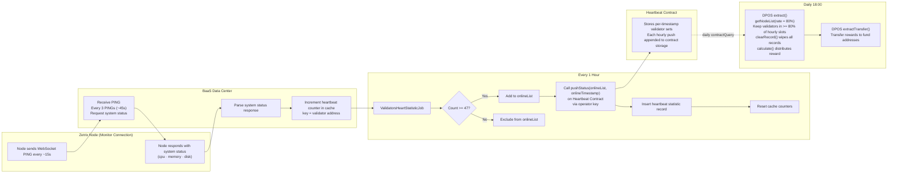

# Heartbeat Accumulation → Reward Eligibility Flow

The following diagram shows how heartbeat signals become reward eligibility input.

#### Eligibility model explained

Eligibility is determined in two stages.

**Stage 1: hourly inclusion**

A validator must accumulate at least 47 heartbeat hits within the hour to appear in that hour's online list.

**Stage 2: cross-hour qualification**

During extract(), the Heartbeat contract checks how often each validator appeared across the stored hourly snapshots. A validator must appear in at least 80% of those slots to qualify for daily reward.
