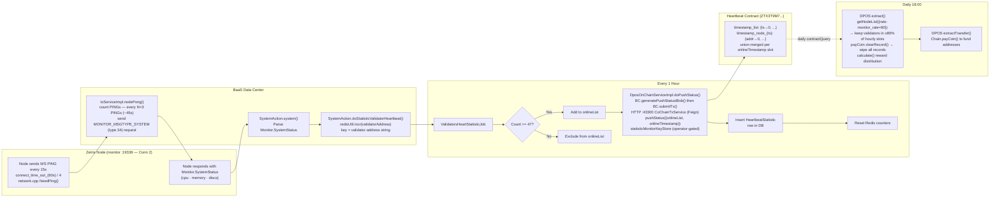

# Heartbeat Accumulation → Reward Eligibility Flow

The following diagram shows how heartbeat signals become reward eligibility input.

Eligibility is determined in two stages.

**Stage 1: hourly inclusion**

Within each hour, a validator must accumulate at least 47 heartbeat hits in Redis to be included in that hour's online list.

This is a local operational threshold used before any on-chain reward logic is applied.

**Stage 2: cross-hour qualification**

During `extract(),` the Heartbeat contract evaluates how often each validator appeared across stored hourly slots. A validator qualifies only if it appears in at least the configured percentage of those slots, for example 80%.

This means hourly inclusion alone does not guarantee reward. Reward depends on sustained presence across the full aggregation period.
