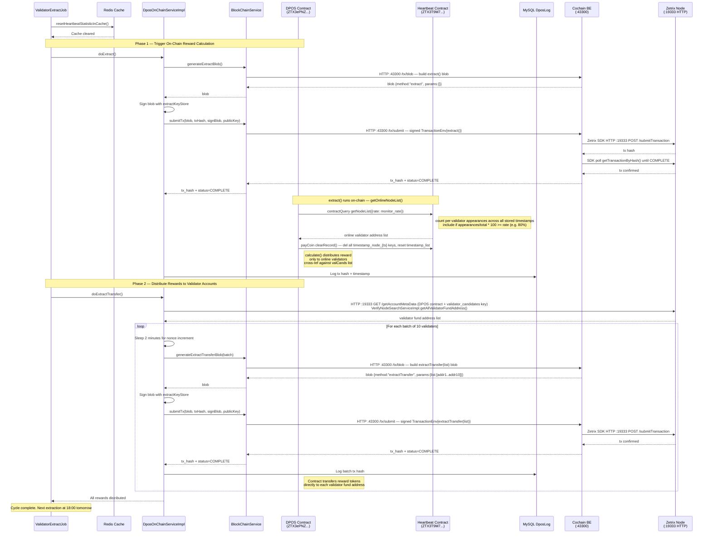

# Reward Extraction Flow

The following sequence diagram shows the two-phase daily reward process.(Daily 18:00)

The reward flow has two distinct phases.

**Phase 1: calculate eligibility and reward amounts**

The `extract()` call causes the DPOS contract to query the Heartbeat contract for the validators that met the configured online-rate threshold across the stored hourly snapshots.

After the eligible list is returned:

* reward calculation is performed on-chain
* only validators satisfying the heartbeat-based policy are considered eligible
* heartbeat records are cleared to prepare for the next cycle

**Phase 2: transfer rewards to fund addresses**

The `extractTransfer(list[])` calls distribute the already calculated rewards to validator fund addresses. Batching is used to control transaction size and nonce handling.

The two-minute delay between batches is operationally significant because it reduces nonce-collision risk when multiple transactions are submitted in sequence.
