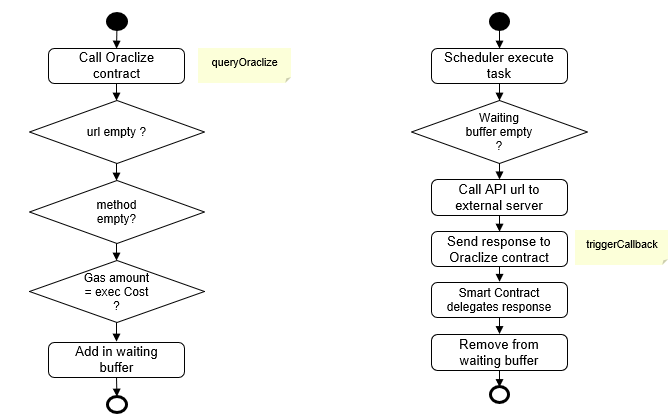

# Zetrix Oraclize

<figure><figcaption></figcaption></figure>

Zetrix Oraclize has been developed to remove the limitation of communication between Smart Contract and outside world. Zetrix Oraclize supports common Rest API methods such as GET, POST, PUT, DELETE Basic and Bearer token authentication methods are supported to establish secure communication.

<figure><figcaption>
Design Architecture
</figcaption></figure>

Zetrix Oraclize also a blockchain oracle service that enables smart contracts on blockchain platforms to interact with external data sources such as APIs, web services, and traditional databases. It achieves this by providing a secure bridge that connects smart contracts to off-chain data, thus avoiding the need for developers to manually input the data. Zetrix Oraclize is designed to provide developers with reliable, transparent, and efficient access to external data, allowing them to build more sophisticated smart contracts and decentralized applications.

<figure><figcaption>
Operation flow
</figcaption></figure>

When using Zetrix Oraclize, developers specify an API call in their smart contract, which is then sent to Oraclize along with the payment required for the call. Oraclize then retrieves the data from the specified data source, verifies the authenticity of the data, and sends it back to the smart contract. The data is then processed by the smart contract according to the programmed logic.

Overall, Zetrix Oraclize provides a useful tool for developers seeking to build more complex and data-heavy smart contracts, as it enables the contracts to interact with external data sources in a secure and efficient way.

## Integration With Oraclize Contract

1. First, need to ensure that have Oraclize and its associated libraries properly installed in the smart contract code.
2. Define the `payCoin` function in the smart contract. This function should accept any necessary parameters and perform the necessary checks and validations before triggering the Oraclize Contract function `queryOraclize`.&#x20;
3. In the `payCoin` function, calculation the cost of the Oraclize query based on its execution cost. The `oraclize_getPrice` function is used to retrieve the cost of the query in ZTX or the relevant cryptocurrency.
4. If the value passed in by the caller is less than the calculated oraclizeCost, the function will revert and throw an error notifying the caller that the funds are insufficient. If it is more than oraclizeCost, the function will refund the extra funds to the caller's account.
5. Once the payment has been made, then trigger the `queryOraclize` function in the Oraclize Contract, along with any necessary parameters such as the amount of cryptocurrency to be queried.

Overall, by triggering the `payCoin` function, can trigger the Oraclize Contract and retrieve external data using Oraclize, while automatically paying the necessary fees based on the execution cost of the query."

<figure><figcaption></figcaption></figure>

<figure><figcaption>
Call payCoin function to trigger Oraclize Contract function “queryOraclize”. The payment is based on execution cost set in Oraclize Contract
</figcaption></figure>

## Integration Protocol For Request

| Item            | Description                                                                                  |
| --------------- | -------------------------------------------------------------------------------------------- |
| URL             | Eg) [http://xxx.com](http://xxx.com/)                                                        |
| method          | POST, GET, PUT, DELETE                                                                       |
| headers         | 
Key Value Json form

Eg )

{

   “Authorization”: “Bearer xxx”

}
 |
| body            | 
Key Value Json form

Eg )

{

   “id”: “xxx”

}
                   |
| callbackAddress | User Contract Address (ZTX….)                                                                |
| callbackMethod  | Predefined Method in User Contract                                                           |

## Integration Protocol For Response

| Item    | Description                 |
| ------- | --------------------------- |
| object  | Json Object                 |
| message | String                      |
| status  | String “SUCCESS” / “FAILED” |

## Example (Request)

Caller Contract : [https://test-explorer.zetrix.com/account/ZTX3WMzq13j47z6HjzLnwRqqwqEdiP1bw93Dp](https://test-explorer.zetrix.com/account/ZTX3WMzq13j47z6HjzLnwRqqwqEdiP1bw93Dp)

Oraclize Contract : [https://test-explorer.zetrix.com/account/ZTX3QLowAYiRnj8ifaHDhUax9CfD1h5CrTB1w](https://test-explorer.zetrix.com/account/ZTX3QLowAYiRnj8ifaHDhUax9CfD1h5CrTB1w)

## Call GET Request from Caller Contract

<figure><figcaption></figcaption></figure>

## Example (Response)

Caller Contract : [https://test-explorer.zetrix.com/account/ZTX3WMzq13j47z6HjzLnwRqqwqEdiP1bw93Dp](https://test-explorer.zetrix.com/account/ZTX3WMzq13j47z6HjzLnwRqqwqEdiP1bw93Dp)

Oraclize Contract : [https://test-explorer.zetrix.com/account/ZTX3QLowAYiRnj8ifaHDhUax9CfD1h5CrTB1w](https://test-explorer.zetrix.com/account/ZTX3QLowAYiRnj8ifaHDhUax9CfD1h5CrTB1w)

## Get Response from Oraclize Contract

<figure><figcaption></figcaption></figure>
