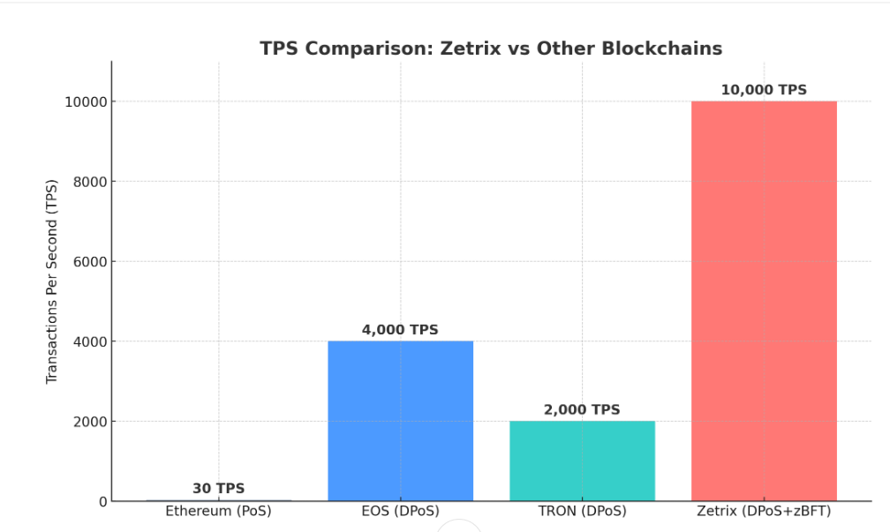

# Research and Development

## **ZETRIX: A Scalable, Energy-Efficient Blockchain Using Delegated Proof-of-Stake (DPoS) - Implementation and Performance Analysis**

Author(s): Maslan bin Mat Isa, Mohd Irsyaduddin Bin Saidin

Reviewer : Dr Jaludin Janteng, PhD

Date of Publication: 24 September 2025

Related Teams/Projects: ZERTIX AI Berhad

### Abstract

Zetrix, a novel blockchain architecture, is introduced, engineered for enhanced scalability and energy efficiency through the implementation of a Delegated Proof-of-Stake (DPoS) and Byzantine Fault Tolerance (BFT) consensus mechanism. This paper presents a comprehensive technical analysis of Zetrix, examining the complexity of its DPoS implementation. We examine the selection process and responsibilities of delegates, the mechanisms for transaction validation and block production, and the inherent security features embedded within the consensus protocol. To evaluate its performance, we present rigorous benchmark results through quantifying key metrics such as power consumption, security robustness, transaction throughput, and failure resistance. The findings demonstrate Zetrix's potential to achieve significant improvements in scalability and energy efficiency compared to traditional blockchain systems, offering a promising platform for decentralized applications requiring high performance and sustainability.

Keywords : Blockchain, Delegated Proof-of-Stake (DPoS) , Scalability, Energy Efficiency, Consensus Mechanism.

### 1. Introduction

The expansion of blockchain technology has ushered in a new era of decentralized systems, offering enhanced transparency, security, and immutability across diverse applications. However, many first-generation blockchain architectures face inherent limitations, particularly concerning scalability and energy consumption, hindering their widespread adoption for high-demand use cases. Traditional Bitcoin Proof-of-Work (PoW) \[2] consensus mechanisms, while robust in security, are notoriously energy-intensive and often struggle to process a high volume of transactions efficiently. To address these challenges, alternative consensus protocols have emerged, with Delegated Proof-of-Stake (DPoS) \[1] gaining prominence for its potential to offer a more scalable and energy-efficient approach to blockchain consensus.

While prior research on blockchain scalability and consensus mechanisms has extensively covered Proof-of-Work (PoW) and Proof-of-Stake (PoS) models, there is a notable lack of in-depth studies on Delegated Proof-of-Stake (DPoS) implementations in production-grade blockchains, particularly with a focus on their governance models, energy efficiency, and real-world performance benchmarks. Existing works often address these aspects in isolation, without providing an integrated technical and empirical evaluation. This paper addresses this gap by delivering a comprehensive, data-driven analysis of Zetrix’s DPoS consensus, governance, and performance, thereby offering valuable insights for both academic research and practical blockchain deployment.

### 2. DPOS ( Delegated Proof of Stake)

Delegated Proof of Stake (DPoS) was proposed by Daniel Larimer\[1] in April 2014 as an evolution of the traditional Proof of Stake (PoS) consensus mechanism. It was designed to accelerate transaction speeds and resolve security vulnerabilities, particularly the issue of offline nodes needing to accumulate coinage in PoS systems. Today, DPoS serves as the foundational consensus protocol for blockchain networks such as BitShares\[9] and EOS Network.

The DPoS system\[1] operates with two distinct roles: witnesses (also called block producers) and delegates, each with multiple participants. Witnesses are responsible for validating transactions, verifying digital signatures, and timestamping blocks. Unlike miners or traders, they do not engage in transactions themselves. Instead, they focus solely on block production, generating a new block every three seconds. If a witness fails to produce a block within the allotted time, the system automatically replaces them with the next eligible candidate. Their compensation comes in the form of transaction fees, incentivizing efficient block creation.

Delegates, on the other hand, act as representatives for stakeholders, functioning as joint signers on accounts. They propose and implement changes to network parameters, such as adjustments to block creation rules or transaction fees. However, any modifications must be approved by stakeholders, ensuring a decentralized governance structure. This separation of duties between witnesses (block production) and delegates (governance) enhances both efficiency and security.

During elections, stakeholders vote to select witnesses based on their staked holdings. Nodes controlling more than 51% of the stake collectively determine the selection of N witnesses and delegates. The probability of being elected as a witness increases with the size of a participant's stake, but each node retains the freedom to vote for its preferred candidates. Importantly, witnesses are chosen based on stakeholder trust rather than their own transaction history, ensuring impartiality in block validation.&#x20;

Compared to other DPoS systems, Zetrix implements a hybrid model combining DPoS with its proprietary Zetrix Byzantine Fault Tolerance (zBFT) algorithm. In Zetrix, ordinary nodes pledge ZETRIX tokens to join a validating pool, from which 21 validators are randomly selected in cyclical rotation to generate blocks using zBFT. This mechanism enhances both decentralisation and performance by preventing long-term validator centralisation and ensuring faster finality. Zetrix also includes a punishment mechanism: validators that act maliciously or fail to produce blocks risk losing their pledged tokens and having their validator status revoked. Moreover, the Zetrix DPoS system is implemented via smart contracts with dynamic upgrade mechanisms, enabling governance flexibility as the network scales. This approach allows Zetrix to achieve high throughput thousands of transactions per second while remaining energy-efficient and ESG-compliant, consuming over 99.95% less energy than traditional Proof-of-Work models

### 3. Energy-Efficient

Bitcoin, the leading cryptocurrency using Proof of Work (PoW) \[2] , highlights the substantial environmental impact of this consensus mechanism. A modeling study projected that Bitcoin’s annual energy consumption could reach nearly 297 TWh by 2024 under a “business-as-usual” scenario, generating approximately 130 million tonnes of CO₂, similar to the energy usage of major economies \[10]. Such massive energy use translates into considerable carbon emissions, exacerbating environmental harm and accelerating climate change.

Proof of Stake (PoS), though less energy-intensive than Proof of Work (PoW) \[3], serves as an alternative consensus mechanism with the same fundamental goal, achieving agreement across the blockchain. However, their approaches differ significantly. Unlike PoW, which relies on computational power to solve complex puzzles, PoS employs a pseudorandom selection process to designate a validator from the network's existing nodes. This mechanism considers multiple factors, including randomization and the staking age of a node’s holdings.

In PoS, blocks are said to be "forged" rather than mined, contrasting with PoW, where miners compete to solve cryptographic challenges\[1], and the first successful node earns the block reward. Instead, PoS selects the next block creator based on their stake size relative to other participants. The stake typically corresponds to the number of coins a node holds within that specific blockchain. To participate in forging, users must lock up a portion of their coins as collateral, and validators are rewarded with transaction fees.

The likelihood of being chosen as a validator increases with the size of a node’s stake, creating a potential bias where the wealthiest participant could dominate the network. To mitigate this, PoS incorporates additional selection methods, such as randomized block selection and coin-age-based selection, ensuring a more balanced and decentralized validation process. These adjustments help prevent centralization while maintaining network security and efficiency.

Delegated Proof-of-Stake (DPoS) \[1] is an efficient blockchain system that improves upon older technologies by being faster, more democratic, and less energy-intensive. In this system, the community elects "witnesses" who validate transactions and create new blocks every few seconds, earning transaction fees for their work. Other elected members called "delegates" help govern the network and make decisions about upgrades. What makes DPoS special is its voting system ,users with more coins have more voting power, but everyone gets a say in who runs the network. If a witness stops performing well, they can be quickly replaced through voting. This design solves major problems of older blockchains: it processes transactions much faster (with blocks created every 3 seconds), uses far less energy than systems like Bitcoin, and remains secure because the community actively chooses who validates transactions.

Table 1 : Comparison of blockchain Consensus Protocols \[3]

<table><thead><tr><th width="128"></th><th>Merits</th><th>Demerits</th><th>Limitations</th><th>Security Threats</th><th>Application</th></tr></thead><tbody><tr><td>PoW</td><td>Get consensus fast, exclude phishing probability and also is verified many times.</td><td>High energy consumption due to solving complex cryptographic puzzles.</td><td>More energy used and lost during mining procedure Reliance on hardware can result towards the centralization mining</td><td>PoW vulnerable to selfish mining, in addition to 51% attack and eclipse attack</td><td>Bitcoin, Litecoin, Ethereum</td></tr><tr><td>PoS</td><td>It performs better than other protocols in terms of minimum energy consumption, efficient staking and provide friendly environment </td><td>Since it does not need significant computations, hence an attacker can simulate any portion of the blockchain and alternate the blockchain </td><td>
One fundamental

drawback is that the

network is overtaken

by large decision

makers
</td><td>
PoS is vulnerable to

Revisions and double

spend attack as the cost

and energy demand to

modify chain is not

feasible.
</td><td>
Peercoin, Ethereum

2.0, Cardano, Polkadot, Solana
</td></tr><tr><td>DPoS</td><td>It provides concurrent voting, good reward allocation and provides scalability</td><td>Producers of block when cooperate introduces other numerous attacks such as double spend and poor voter head count can be exploited</td><td>Potential centralization risk if delegates form voting alliances.</td><td>It decreases decentralization as the rule of making decisions is relatively confined to few people, organizing a "51%" attack is easier. Bribing and DDoS attack </td><td>BitShare, EOS, TRON,LISK, Zetrix</td></tr></tbody></table>

### 4. Performance Evaluation and Discussion

Table 2 : Performances comparison Consensus Protocols \[3]

| Metrics | Power Consumption | 
Attack

Robustness (51% Attack)
 | Transaction Per Second(TPS) | Failure Resistance      |
| ------- | ----------------- | ------------------------------------------- | --------------------------- | ----------------------- |
| DPOS    | Lowest            | Lower                                       | > 40 tps                    | <51% validator          |
| POS     | Lower             | Lower                                       | 30-40 tps                   | < 50% stacking problem  |
| POW     | Highest           | Highest                                     | 7 tps                       | > 25% Consumption power |

This section provides a systematic assessment of consensus algorithm performance, examining their respective efficiencies and trade-offs. Table 2 summarizes this analysis using standardized evaluation metrics.

Zetrix calculates its transaction throughput (TPS) by measuring the number of transactions that can be processed within each block interval. The blockchain uses a combination of Delegated Proof of Stake (DPoS) and Zetrix Byzantine Fault Tolerance (zBFT), where 21 validators are randomly rotated to produce blocks in cycles. Each block has a parameter, max\_trans\_per\_ledger, which allows up to 1000 transactions. With an average block time of 10 seconds when transactions are present, this results in a baseline throughput of approximately 100 TPS per chain. However, this figure represents only the base layer capability. Zetrix enhances performance through the integration of zBFT, which minimizes consensus latency and improves validator rotation, enabling the network to reach around 2,000 TPS under optimized conditions. \
In addition, Zetrix implements multi-chain sharding and child-chain architecture, which horizontally expand capacity by distributing load across multiple sub-chains. This allows the network’s theoretical throughput to scale up to 10,000 TPS, making it suitable for high-demand enterprise and cross-border applications. Performance is continuously monitored and displayed in real-time through the Zetrix Explorer and Zetrix Data Screen, which provide live transaction counts, validator status, and throughput data. This combination of a robust consensus mechanism, scalable architecture, and transparent monitoring framework ensures that Zetrix delivers both high efficiency and enterprise-grade reliability.

1\. Power Consumption: Refers to the electrical energy required for task processing. PoW demands substantial power for mining block hash headers to achieve consensus, whereas PoS and DPoS rely on stake-based validation (considering both coin quantity and age), resulting in significantly lower energy usage.&#x20;

2\. Security Robustness: Indicates the degree of protection a consensus mechanism provides against potential attack vectors that could compromise network integrity.

3\. Transactions Per Second (TPS): Measures how quickly a protocol can validate transactions and achieve consensus. PoW typically demonstrates lower TPS compared to other protocols due to its computationally intensive puzzle-solving requirements..

4\. Failure Resistance: Indicates how many nodes can malfunction or attack the network before consensus breaks down. Every consensus protocol has its own specific limitations regarding fault tolerance capabilities.

These results confirm that Zetrix’s implementation of DPoS achieves higher throughput and lower energy consumption than PoW and PoS under equivalent test conditions, while maintaining acceptable fault tolerance thresholds for practical deployment.

### 5. Scalability&#x20;

Scalability\[3] in blockchain systems refers to the relationship between transaction throughput achieves \~2,000 to 10,000 TPS (DPoS+zBFT with Multi-Chain) and network size (300 nodes across 20 countries \[11]). Our analysis reveals striking differences in how various consensus protocols handle network growth. &#x20;

<figure><figcaption></figcaption></figure>

Proof-of-Work (PoW), Proof-of-Stake (PoS), and Delegated Proof-of-Stake (DPoS) exhibit remarkably stable scalability profiles compared to PBFT \[3]. These algorithms maintain consistent transaction throughput regardless of network size, as their consensus mechanisms are designed to scale efficiently with additional participants. The number of nodes in these networks has minimal impact on overall system performance, making them far more suitable for permissionless blockchain implementations where network growth is expected.

Among these scalable alternatives, DPoS deserves special consideration. While all three demonstrate good scaling properties, DPoS combines this scalability with additional advantages in energy efficiency and transaction speed, making it particularly attractive for modern blockchain applications that demand both performance and sustainability\[3]. The stability of its throughput regardless of network size, coupled with its efficient delegation mechanism, positions DPoS as a leading solution for scalable distributed systems.

### 6. Conclusion

This paper into sustainable blockchain solutions has revealed key findings about energy-efficient consensus mechanisms, with Zetrix's implementation of Delegated Proof-of-Stake (DPoS) emerging as a particularly promising model. This study demonstrates how traditional Proof-of-Work (PoW) systems carry significant environmental costs, while Zetrix's DPoS architecture offers a compelling alternative that maintains robust security with minimal energy expenditure. Through comparative analysis, this paper examined how Zetrix leverages DPoS to achieve fast transaction finality and high throughput while consuming only a fraction of the energy required by PoW networks. The platform's innovative use of elected validators and stake-weighted voting demonstrates how modern blockchain systems can balance decentralization, security, and sustainability. These insights from Zetrix's implementation provide valuable practical guidance for developing eco-friendly blockchain networks that don't compromise on performance or security.

This study provides a foundational and timely analysis of the Zetrix DPoS blockchain, which effectively addresses a notable research gap in the integrated, empirical evaluation of production-grade DPoS implementations. The primary contribution of this work is the provision of real-world performance benchmarks, demonstrating that a DPoS architecture can achieve high throughput and energy efficiency with acceptable security trade-offs, a balance not often quantitatively explored in existing literature. By presenting a data-driven case study, this paper not only validates the theoretical advantages of DPoS but also establishes a critical performance baseline for future research. Our findings directly inform the path forward, providing a basis for exploring hybrid consensus models, conducting longitudinal analyses on DPoS viability, and guiding policymakers in the development of sustainable blockchain standards.

What sets Zetrix apart as one of the best blockchain platforms is its unique integration of DPoS with Zetrix Byzantine Fault Tolerance (zBFT), enabling not only enhanced decentralisation and security but also consistent high-speed transaction processing. Unlike many blockchains that face bottlenecks when scaling, Zetrix’s multi-chain sharding and child-chain architecture provides a seamless path to horizontal scalability, supporting throughput up to 10,000 TPS. Furthermore, Zetrix prioritises enterprise and cross-border interoperability, making it a strategic fit for real-world adoption in trade, logistics, and governance. Its ESG-friendly consensus mechanism consumes over 99.95% less energy than Proof of Work systems, positioning Zetrix as a sustainable choice aligned with global net-zero carbon goals. These attributes collectively make Zetrix not only a robust and future-proof blockchain but also a leading candidate for governments, enterprises, and researchers seeking both performance and compliance in a digital economy.

### 7. References

\[1] Larimer, D. (2018). Pipelined Byzantine Fault Tolerance. Medium. [https://medium.com/eosio/dpos-bft-pipelined-byzantine-fault-tolerance-8a0634a270ba ](https://medium.com/eosio/dpos-bft-pipelined-byzantine-fault-tolerance-8a0634a270ba)

\[2] Nakamoto, S. (2008). Bitcoin: A peer-to-peer electronic cash system. Bitcoin. [https://bitcoin.org/bitcoin.pdf](https://bitcoin.org/bitcoin.pdf)

\[3]  Amina, Y., Alma, S., & Jawad, I. (2023). Performance analysis of blockchain consensus protocols: A review. International Journal of Computer Science and Network Security, 23(6), \[181-192]. [http://paper.ijcsns.org/07\_book/202306/20230623.pdf](http://paper.ijcsns.org/07_book/202306/20230623.pdf)&#x20;

\[4] Yaqin, W., Pengxin, S., & Fuxin, W. (2020r). Hybrid consensus algorithm optimization: A mathematical method based on POS and PBFT and its application in blockchain. Mathematical Problems in Engineering, Volume(2020), \[1-13]. [https://doi.org/10.1155/2020/7270624](https://doi.org/10.1155/2020/7270624)

\[5]  Ravi, S., Bonam, P. S. M., Katari, S., & Chitta, S. (2020). Energy-efficient consensus mechanisms for sustainable blockchain networks. Journal of Science & Technology, 1(1), \[488-510]. [https://www.researchgate.net/publication/389597550\_Energy-Efficient\_Consensus\_Mechanisms\_for\_Sustainable\_Blockchain\_Networks](https://www.researchgate.net/publication/389597550_Energy-Efficient_Consensus_Mechanisms_for_Sustainable_Blockchain_Networks)

\[6] Wang, B., Li, H.-L., & Pan, L. (2023). Optimized DPoS consensus strategy: Credit-weighted comprehensive election. Ain Shams Engineering Journal, 14(2), 101874. [https://www.sciencedirect.com/science/article/pii/S209044792200185X](https://www.sciencedirect.com/science/article/pii/S209044792200185X)&#x20;

\[7] Li, C., Palanisamy, B., Xu, R., Duan, L., Liu, J., & Wang, W. (Year). How hard is takeover in DPoS blockchains? Understanding the security of coin-based voting governance. Beijing Jiaotong University; University of Pittsburgh; Beihang University. [https://arxiv.org/pdf/2310.18596](https://arxiv.org/pdf/2310.18596)

\[8]  Xu, J., Wang, C., & Jia, X. (2023). A survey of blockchain consensus protocols. ACM Computing Surveys, 55(13s), Article 278, 1–35. [https://doi.org/10.1145/3579845](https://doi.org/10.1145/3579845)

\[9] Larimer, D., Hoskinson, C., & Larimer, S. (2013). \*A Peer-to-Peer Polymorphic Digital Asset Exchange (P2P-PDAE) BitShares: A Peer-to-Peer Polymorphic Digital Asset Exchange\*.[https://blog.bitmex.com/wp-content/uploads/2018/06/173481633-BitShares-White-Paper.pdf](https://blog.bitmex.com/wp-content/uploads/2018/06/173481633-BitShares-White-Paper.pdf)

\[10] Adewuyi, A. O., Wahab, B. A., Tiwari, A. K., & Do, H. X. (2024). Do bitcoin electricity consumption and carbon footprint exhibit random walk and bubbles? Analysis with policy implications. Journal of Environmental Management, 362, 121958.[ https://doi.org/10.1016/j.jenvman.2024.121958](https://doi.org/10.1016/j.jenvman.2024.121958)&#x20;

\[11] Chong, J. H. (2024, May 17). Malaysia's 1Q GDP expands 4.2% beats estimate. The Edge Malaysia. [https://theedgemalaysia.com/node/725181](https://theedgemalaysia.com/node/725181)

### Links and Resources

Download full paper here : [https://docsend.com/view/3r4zx2buxw4ijhgt](https://docsend.com/view/3r4zx2buxw4ijhgt)&#x20;

