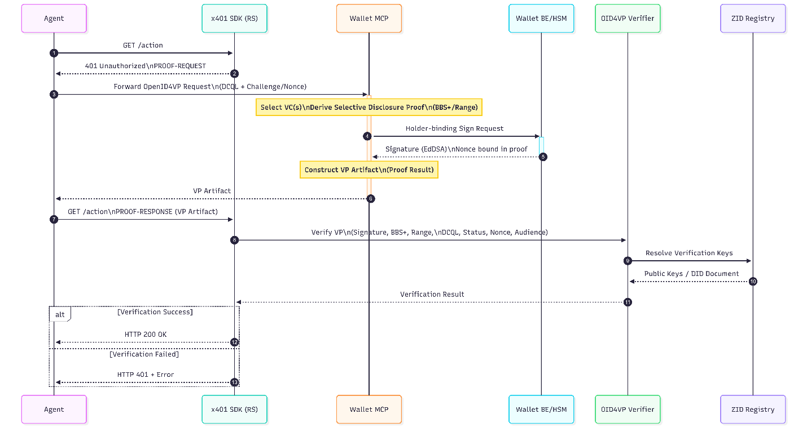

# Baseline flow (identity only)

<figure><figcaption>
x401 baseline flow: identity only
</figcaption></figure>

* **Request.** Agent requests a protected resource with no proof.
* **Challenge.** The X401 SDK returns 401 Unauthorized (`Cache-Control: no-store`) with the challenge carrying the credential requirement, including a verifier challenge/nonce.
* **Presentation acquisition.** The agent forwards the embedded OpenID4VP request (JAR), DCQL and challenge intact, to the Agentic Wallet MCP. The MCP selects credentials, **derives the SD proof in software** (BBS+/range), and requests a **holder-binding signature from the HSM via the Wallet BE**, with the verifier challenge threaded into the signed material (Ed25519 nonce binding).
* **Retry.** Agent submits the proof artifact to `POST /presentation/submit`.
* **Verify & respond.** The OID4VP Verifier validates **in-process**, signature, BBS+, range-proof, DCQL, status, nonce/audience, resolving issuer keys from the on-chain ZID Registry. Result delivery is **sync-HMAC** (inline) or **callback**.


**Per-request re-validation.** The Resource Server re-validates proof on **every** request, not only the first (stateless design permitted via a self-contained, verifier-signed nonce). Only `openid4vp-v1-signed` and `openid4vp-v1-unsigned` exist in the spec.

