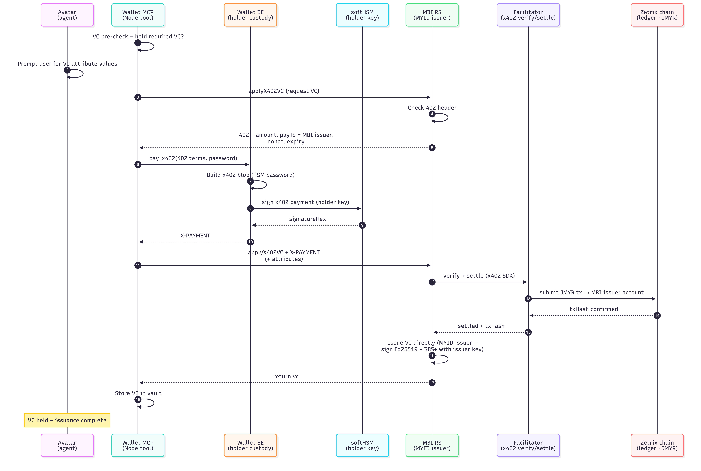
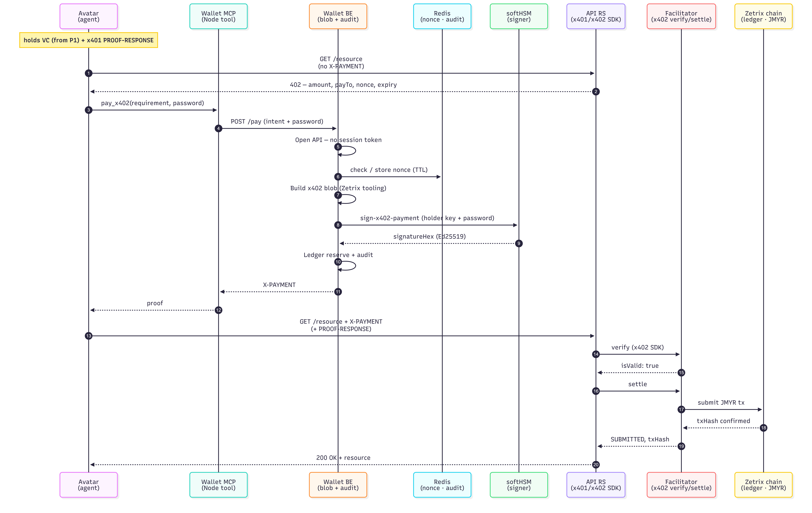
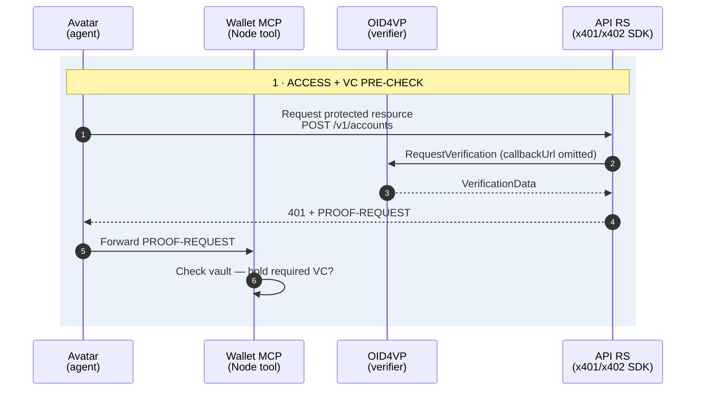
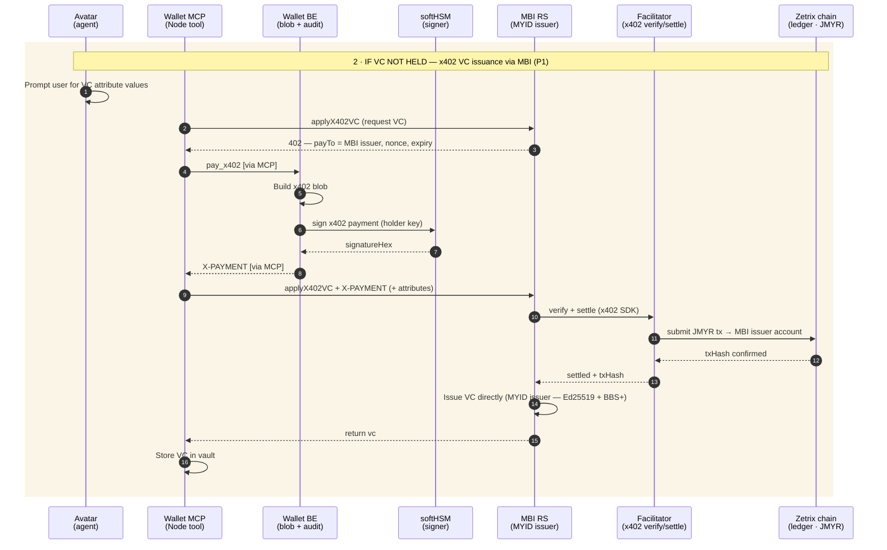
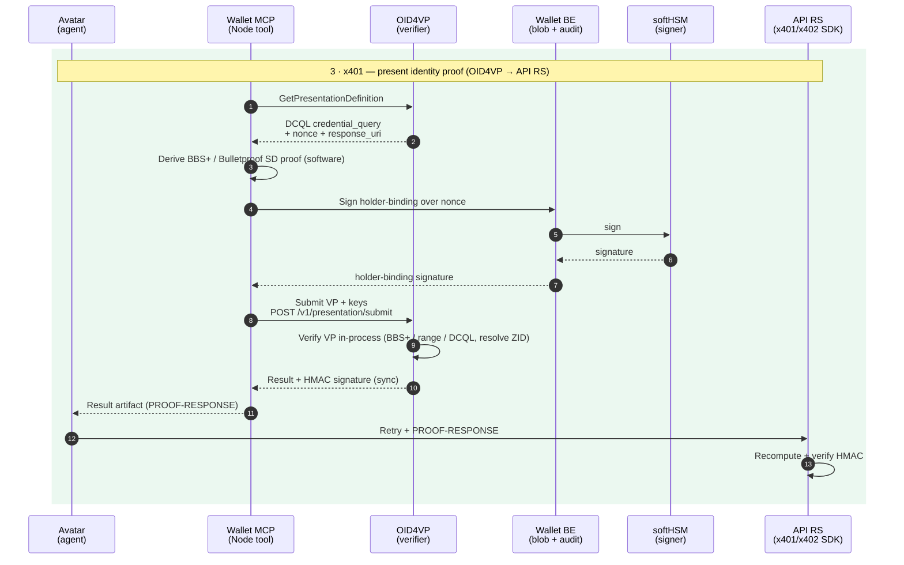
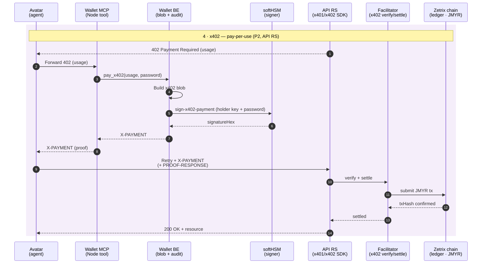

# POC payment architecture: P1 (issuance) and P2 (pay-per-use)

The POC realizes x402 as **two payment programs** against two resource servers. **JMYR (a ZTP20 token)** or **native ZETRIX** may be used; the technical team decides. **Policy-engine checks are explicitly out of scope** for the POC.

## P1: VC issuance via MBI (paid issuance)

The **MBI Resource Server (MYID issuer)** both settles the payment and issues the VC in one location, because it holds the issuer key.

<figure><figcaption><p>P1: paid VC issuance via MBI</p></figcaption></figure>

* The wallet initiates issuance with `applyX402VC`.
* MBI returns x402 payment terms with `payTo` = the MBI issuer account.
* The wallet builds the **x402 payment blob (unsigned)** and signs it via the **SoftHSM holder key** (password-gated).
* MBI calls `/facilitator/verify` + `/facilitator/settle`; on settlement it **issues the VC directly** (Ed25519 + BBS+).
* The agent stores the VC in its **Vault**.

### Overview

x402 revives the long-reserved HTTP 402 Payment Required status as a machine-to-machine payment handshake: request → 402 with terms → pay on-chain → retry with proof of payment → resource served. The wallet has **no x402 client SDK**; Wallet BE builds the payment blob with Zetrix tooling and signs it with the holder key in softHSM. Settlement runs through the **Facilitator** onto the Zetrix chain.

### Messages (x402 wire format)

**The 402 Payment Required challenge** follows the x402 wire format (`x402Version` + `accepts[]`) so standard x402 clients can consume it. It is returned **raw** (not inside the service's response envelope). One `accepts[]` entry per configured asset; the holder picks one:

```json
{
  "x402Version": 1,
  "error": "payment required to issue credential",
  "accepts": [
    {
      "scheme": "exact",
      "network": "zetrix:testnet",
      "maxAmountRequired": "100",              // smallest unit — EXACT match required
      "resource": "/v1/vc/pay/apply",
      "payTo": "Z...",                          // issuer (or resource) account
      "asset": "Z<ztp20-contract>",             // JMYR (ZTP20); native ZTX currently disabled in config
      "maxTimeoutSeconds": 300,
      "extra": { "paymentId": "b1e2…", "templateCode": "myid_identity", "issuerAddress": "Z..." }
    }
  ]
}
```

**The retry** carries an `X-PAYMENT` header, `base64(JSON)` of the facilitator payment payload. It is **self-pay** (`gasModel: client`): the wallet (via Wallet BE) builds and signs its **own** transfer blob to `payTo`:

```json
{
  "x402Version": 2,
  "scheme": "exact",
  "network": "zetrix:testnet",
  "payload": {
    "type": "signed_transaction",              // self-pay only; sponsored path not accepted
    "validBefore": 1720000000,
    "transactionBlob": "0A2F...hex...",         // holder-built transfer to payTo
    "signatures": [ { "sign_data": "3044...hex...", "public_key": "b0014...hex..." } ]  // holder key (softHSM)
  }
}
```

The settling party (MBI for issuance, RS for usage) verifies amount/`payTo`/asset **exactly** (overpayment is rejected), then calls the Facilitator `POST /ztx/facilitator/verify` (→ `isValid`) and `POST /ztx/facilitator/settle` (→ `status: "SUBMITTED"` + `txHash`). Self-pay settlement is **synchronous**. On success the response carries `X-PAYMENT-RESPONSE: base64({ success, txHash, networkId })`.

### Two payment purposes

|  | Subscription (one-time) | Pay-per-use (usage) |
| --- | --- | --- |
| When | The agent needs a credential it does not hold | Every subsequent paid API call |
| Endpoint | Zetrix BaaS VC issuer | API Resource Server |
| Result | The API Subscription Credential is issued | That one call succeeds |
| Frequency | Once | Per request |

## P2: pay-per-use (x401 + x402 on the API Resource Server)

For protected, metered APIs the **API Resource Server** requires proof and payment on the same call:

<figure><figcaption><p>P2: pay-per-use (x401 + x402 on the API RS)</p></figcaption></figure>

The PROOF-RESPONSE carries the x401 VP (validated by the OID4VP verifier) and is **paired with the x402 payment blob** for the metered call.

**Simplifications adopted (changes from the prior design):**

* **Eliminated** the Wallet BE on-chain `txHash` verification for P1.
* **Eliminated** PENDING / consumed-set tracking for P1.
* **New:** MBI settles and issues in one location.
* **Signing:** password-gated SoftHSM calls; no session tokens.

## Combined end-to-end: first paid access

First time an agent hits a paid resource: check vault → if no VC, x402 one-time issuance via MBI (P1) issues the VC → present the VC as x401 proof (VP submitted to the OID4VP verifier, result relayed as PROOF-RESPONSE to the API RS) → x402 pay-per-use (P2) for the call. Phase 2 runs only when no VC is held; on later calls it's skipped.

#### Access and VC pre-check



#### VC issuance via MBI (P1)



#### x401 identity proof (OID4VP → API RS)



#### x402 pay-per-use (P2, API RS)


