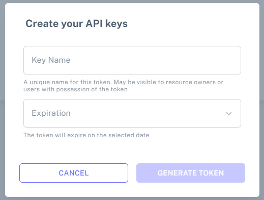

# Create New Joint Account

### Purpose

Create a new multisignature account from scratch. This setup process allows you to configure signers, assign approval weights, and define the required signature threshold, resulting in a secure joint account where transactions can only be executed once enough authorized participants approve them.

### Required Inputs

* **Account Name** → For identification in dashboard
* **Signers List** → Wallet addresses allowed to sign
* **Weight Configuration** → Each signer assigned a numeric weight
* **Threshold** → Minimum total approval weight required

#### Example Setup

| Signer  | Weight |
| ------- | ------ |
| Admin A | 10     |
| Admin B | 10     |
| Admin C | 10     |

Threshold = 20\
Means → Any **two major admins** required in order to execute the operation.

## Flow

1️⃣ **Open Create Account**

Open the Create Account section to begin the process of setting up a new multisignature account. This is the first step where you will start configuring the account details, adding signers, assigning approval weights, and defining the required threshold for transaction approvals.

<figure><figcaption></figcaption></figure>

2️⃣**Enter Joint Account Name**

Enter the Joint Account Name. This is the display name that will be used to identify this multisignature account within the application dashboard and throughout the system. Choose a meaningful and recognizable name to help users easily distinguish this account from others.

<figure><figcaption></figcaption></figure>

3️⃣**Enter account configuration**

Enter the account configuration details, including the account name, list of signers, their respective approval weights, and the required approval threshold. These settings define how the multisig account will operate and how transaction approvals will be managed.

<figure><figcaption></figcaption></figure>

4️⃣**Confirm and submit**

Review all the account details carefully, including signers, weight distribution, and approval threshold. Once you are satisfied, confirm the configuration and deploy the multisig account to the Zetrix blockchain. This action will finalize the setup and activate the joint account.

<figure><figcaption></figcaption></figure>

