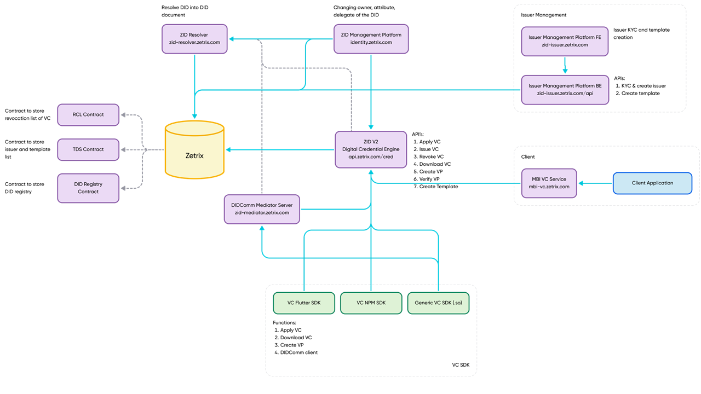

# Verifiable Credentials

## Introduction to Verifiable Credentials

What Are Verifiable Credentials?

**Verifiable Credentials (VCs)** are digital credentials that are cryptographically secure, privacy-respecting, and machine-verifiable. Based on the **W3C VC standard**, they are used to represent information such as ID cards, academic degrees, and licenses in a decentralized way.

A VC typically includes:

* **Issuer** (who issued it)
* **Subject** (who it's about)
* **Claims** (the data)
* **Proof** (digital signature)

#### Why Use VCs on Zetrix?

* **Trustless Verification**: No need to call the issuer to validate a VC.
* **Data Integrity**: Credentials are tamper-evident.
* **Privacy-Preserving**: Support for selective disclosure with BBS+ signatures.
* **Decentralized Identity (DID)**: Users are identified by unique, blockchain-resolved `did:zid` identifiers.
* **Ed25519 + BbsBls**: Signature schemes used for W3C compliance and selective disclosure.

## High-Level Overview

### Roles

* **Issuer**: Entity that issues a VC.
* **Holder**: The recipient of the VC.
* **Verifier**: Entity that checks the authenticity of a VC or Verifiable Presentation (VP).

### Credential Lifecycle

1. **Template Creation**: Issuer defines the schema of the credential.
2. **VC Application**: Holder requests a VC using a defined template.
3. **VC Issuance**: Issuer fills in fixed values, signs, and issues the VC.
4. **VC Download**: Holder downloads the issued VC.
5. **VP Creation**: Holder creates a Verifiable Presentation.
6. **VP Verification**: Verifier checks the proof.
7. **VC Revocation** _(optional)_: Issuer can revoke an issued VC.

## High Level Architecture

<figure><figcaption></figcaption></figure>

### **Blockchain Smart Contracts Layer**

The ZID ecosystem is underpinned by smart contracts deployed on the Zetrix blockchain. These contracts serve critical roles in preserving the integrity and immutability of identity and credential data. The **Revocation List Contract (RCL)** ensures that once a Verifiable Credential (VC) is revoked, this status is permanently and publicly recorded, enabling any verifier to check its validity.&#x20;

The **Trusted Dataset (TDS) contract** acts as a registry for recognized issuers and credential templates, which standardize the types of credentials that can be issued across the ecosystem.&#x20;

Finally, the **DID Registry Contract** stores all decentralized identifiers (DIDs) created on the network, and supports lifecycle management operations such as ownership changes and delegation.

### Zetrix Blockchain

At the core of the architecture lies the Zetrix Layer-1 blockchai&#x6E;**,** a decentralized and high-performance infrastructure that ensures security, auditability, and immutability of all identity-related operations. All DID documents, VCs, credential templates, and revocation logs are permanently stored on-chain, making Zetrix the single source of truth for digital identity operations within the ecosystem.

### ZID Resolver

The ZID Resolver is a web service endpoint (_zid-resolver.zetrix.com)_ designed to translate a decentralized identifier (DID) into its associated DID document. It interacts with the Zetrix blockchain to fetch public keys, service endpoints, and other identity metadata encoded in the DID document. This resolution process is critical for verifying the authenticity and integrity of interactions between identity holders, issuers, and verifiers.

### ZID Management Platform

Operating at _identity.zetrix.com_ (to-be launched), the ZID Management Platform provides a user interface and backend services for managing the lifecycle of DIDs. This includes assigning delegates, updating attributes, and transferring ownership of DIDs. This platform ensures decentralized control over identity by empowering users with tools to manage their on-chain presence.

### Issuer Management Platform

This component facilitates issuer onboarding and template creation through both front-end (_zid-issuer.zetrix.com_) and API endpoints (_zid-issuer.zetrix.com/api_). The front-end interface is used by issuers to perform Know Your Customer (KYC) procedures and manage their credential issuance capabilities. The backend APIs enable the automation of KYC and template registration workflows, forming the administrative layer that ensures only verified issuers are authorized to operate within the ecosystem.

### ZID Digital Credential Engine

Located at _api.zetrix.com/cred_, this engine provides the core functionality required to manage the lifecycle of Verifiable Credentials. It exposes APIs for applying, issuing, downloading, and revoking credentials, as well as for creating and verifying Verifiable Presentations (VPs). Templates can also be registered via this interface, allowing for structured and interoperable credential issuance. The engine is a central orchestrator that coordinates between SDKs, smart contracts, and issuer services.

### DIDComm Mediator Server

The Mediator Server at _zid-mediator.zetrix.com_ supports DIDComm messaging, facilitating encrypted, peer-to-peer communication between identity holders and verifiers or issuers. This ensures that VCs and VPs can be exchanged securely and privately over the network without relying on centralized intermediaries.

### VC SDKs (Software Development Kits)

The ZID ecosystem offers several SDKs for integrating VC functionality into applications. The Flutter SDK supports mobile development for Android and iOS platforms, while the NPM SDK caters to web and backend JavaScript environments. For cross-platform and embedded integrations, the Generic VC SDK in the form of a shared object (.so) library is provided. All SDKs offer standardized methods for applying for credentials, downloading them, creating presentations, and handling secure DIDComm-based exchanges.

### Data Flow Summary

The ecosystem functions through interconnected layers. A DID is first created using the ZID Management Platform and stored on-chain via the DID Registry Contract. An issuer undergoes KYC via the Issuer Management Platform, after which it can register credential templates. When a credential is issued, it is processed by the ZID engine. Users can retrieve their credentials via the SDKs or the MBI VC service integrated within the client's system. The integrity and revocation status of credentials can always be verified through the resolver and RCL contract, ensuring a fully decentralized and trustless identity framework.
