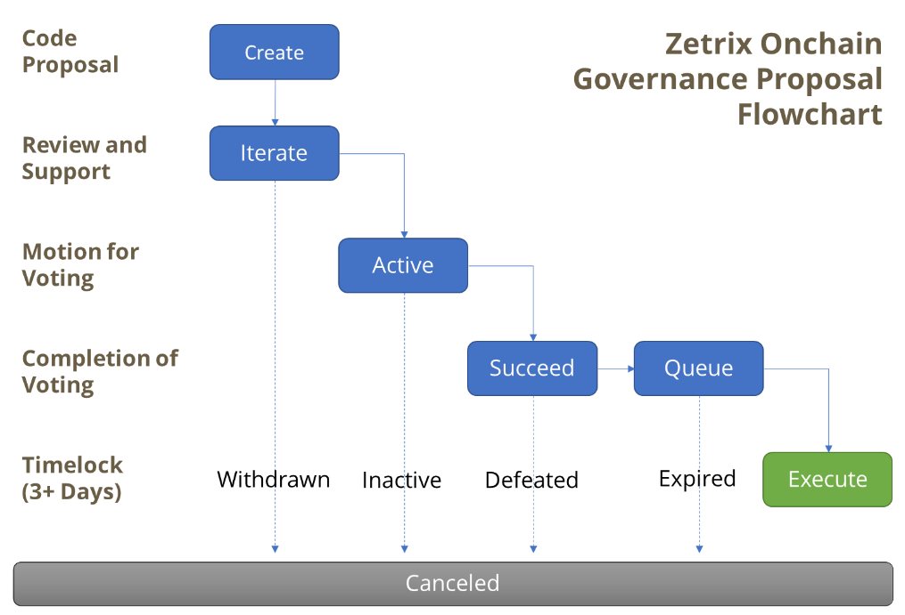

# DID Management Platform

A DID Platform provides tools to manage decentralized identities, keys, attributes, and rights associated with an entity (person, organization, or device). Each DID contains a **DID Document**, which holds public keys, verification methods, services, and permissions.

All onboarding steps should first be performed on the **Testnet environment** for testing, and once validated, the same steps can be applied on **Mainnet** for production use:

* **Testnet:** [https://identity-sandbox.zetrix.com/](https://identity-sandbox.zetrix.com/)
* **Mainnet:** [https://identity.zetrix.com/](https://identity.zetrix.com/)

<figure><figcaption></figcaption></figure>

The following functionalities represent the core operations in a DID Management Console:

### Change Owner

**Purpose:**\
Transfer ownership or administrative rights of a DID to another entity.

**How it works:**

* Every DID has an **owner** (often defined via controller DID).
* The owner can be changed by updating the DID Document’s **controller** field.
* After update, the new owner gains full control of:
  * key creation/removal
  * delegation management
  * attribute management
  * credential signing rights (if applicable)

**Use cases:**

* Organization transferring DID ownership to a new department.
* Rotating root-level admin keys.
* Enforcing governance or recovering compromised ownership.

#### Steps:

The **Issuer** will login Zetrix Wallet and log in to website to change the owner. The steps are as follows:&#x20;

1. Click on **Change Owner.**
2. Fill up the new owner DID.
3. Update.
4. Submit sign using pop up wallet.

<figure><figcaption></figcaption></figure>

### Manage Attribute

**Purpose:**\
Add or remove metadata linked to a DID.

**Common DID Attributes include:**

* service entries (API endpoints, VC endpoints)
* cryptographic fingerprint

**Attribute Management includes:**

* **Add attribute** – Insert a new attribute (e.g., service endpoint).
* **Delete attribute** – Remove outdated or invalid attributes.

**Use cases:**

* Add an Issuer’s Verification endpoint (`/verify`).
* Adding a DIDComm messaging endpoint.
* Storing public profile (organization name, logo URL, contact email).

#### Steps:

The **Issuer** will login Zetrix Wallet and log in to website to manage the attribute. The steps are as follows:&#x20;

1. Click on **Manage Attribute**.
2. Click on **Add Attribute**.
3. Please select Algorithms and Encoding needed.
   1. The **algorithm** specifies the cryptographic algorithm used by the public key you are adding.
      1. **Ed25519** – general signing, authentication
      2. **X25519** – encryption / key agreement
      3. **BBS+** – zero-knowledge proof credentials
   2. Encoding describes **how the public key is formatted** when stored in the DID Document.
      1. **Hex** – Public key shown in raw hexadecimal bytes.\
         Example field: `publicKeyHex`
      2. **Base64** – Common web-safe format used in WebCrypto.\
         Example field: `publicKeyBase64`
      3. **Base58** – Human-friendly Base58 format.\
         Example field: `publicKeyBase58`
      4. **Multibase** – Base58 or Base64 but with a prefix (like `z`) telling the system which encoding is used.\
         Example field: `publicKeyMultibase`
      5. **PEM** – RSA key format with `-----BEGIN PUBLIC KEY-----`.\
         Example field: `publicKeyPem`
4. Enter Public Key Value in the input textbox.
5. Update.
6. Submit sign using pop up wallet.

<figure><figcaption></figcaption></figure>

<figure><figcaption></figcaption></figure>

<figure><figcaption></figcaption></figure>

### **Update Delegation**

**Purpose:**\
Assign or modify **delegated permissions** for another DID or key.

There are two common types:

#### **Authentication Delegation**

Allows another DID or key to authenticate as the DID owner (e.g., login or signing).

#### **Authorization Delegation**

Allows a delegate to perform specific actions such as:

* issuing credentials
* managing sub-identities
* signing VC metadata
* administering services

**Operations include:**

* Add delegation (assign delegate DID)
* Revoke delegation (remove delegate rights)

**Use cases:**

* Company CEO DID delegating signing authority to HR manager DID.
* An IoT hub delegating actions to child IoT devices.
* Rotating delegated keys without changing DID ownership.

#### Steps:

The **Issuer** will login Zetrix Wallet and log in to website to update delegation. The steps are as follows:&#x20;

1. Click on **Update Delegation**.
2. Click on **Add Delegation**.
3. Enter delegate DID for delegation.
4. Choose type of delegation for&#x20;
   1. Signature Authentication
   2. Verification Key
5. Add validity for use case.
6. Update.
7. Submit sign using pop up wallet.

<figure><figcaption></figcaption></figure>

<figure><figcaption></figcaption></figure>

<figure><figcaption></figcaption></figure>

### **Create BBS+ Key**

**Purpose:**\
Generate a **BBS+ signing key pair**, used for **Zero-Knowledge Proof (ZKP)** credentials.

**BBS+ Capabilities:**

* Multi-message signatures
* Selective disclosure
* Privacy-preserving Verifiable Credentials
* Support for W3C VC ZKP formats

**Where BBS+ is used:**

* Issuers create BBS+ keys to sign credentials such as:
  * education certificates
  * IDs with ZKP support
  * medical or employment credentials
* Holders can generate proofs revealing only required fields.

**Example:**\
If a VC contains _(Name, DOB, Nationality, Address),_ BBS+ allows revealing only _(Nationality)_ without exposing the rest.

#### Steps:

The **Issuer** will login Zetrix Wallet and log in to website to create a **BBS+ Key**. The steps are as follows:&#x20;

1. Create **BBS++ Key**.
2. Generate Key.
3. Add Validity for use case.
4. Submit/Update.
5. Submit sign using pop up wallet.

<figure><figcaption></figcaption></figure>

<figure><figcaption></figcaption></figure>

The **BBS+ public key** will be displayed in your ZID document after it is created.

<figure><figcaption></figcaption></figure>

### **Create X25519 Key**

**Purpose:**\
Generate an **X25519 key pair** for secure encryption and key exchange.

**X25519 is used for:**

* DIDComm v2 messaging
* Encrypted communication
* Secure session key negotiation
* Holder ↔ Verifier secure data exchange

**Why X25519?**

* Lightweight and fast
* Modern elliptic-curve cryptography
* Strong forward secrecy
* Recommended for DID secure messaging protocols

**Use cases:**

* Establish encrypted channels for Verifiable Presentation (VP).
* Encrypt wallet-to-server communication.
* DID-based encrypted chat systems.

#### Steps:

The **Issuer** will login Zetrix Wallet and log in to website to create X25519 key. The steps are as follows:&#x20;

1. Click on **Create X25519 Key**.
2. Click on **Generate Key** and will auto generated below.
3. Add validity date for use case.
4. Update.
5. Submit sign using pop up wallet.

<figure><figcaption></figcaption></figure>

<figure><figcaption></figcaption></figure>
